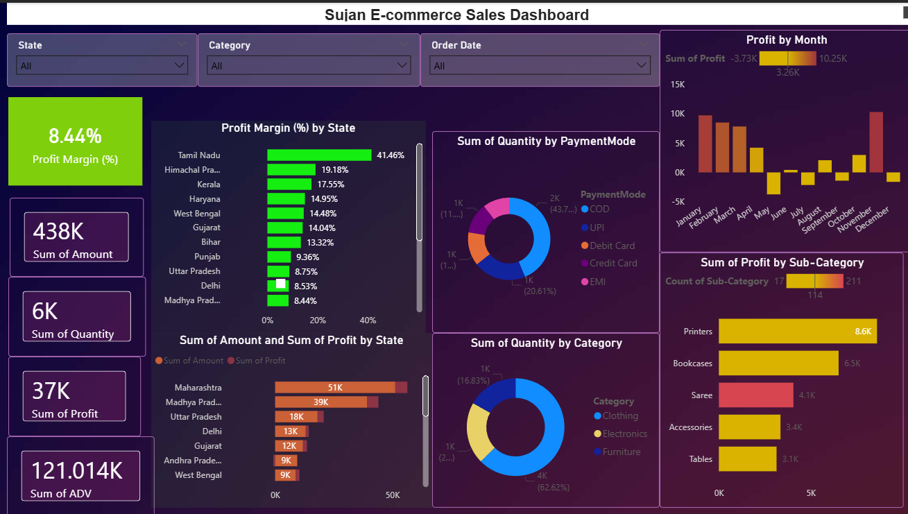
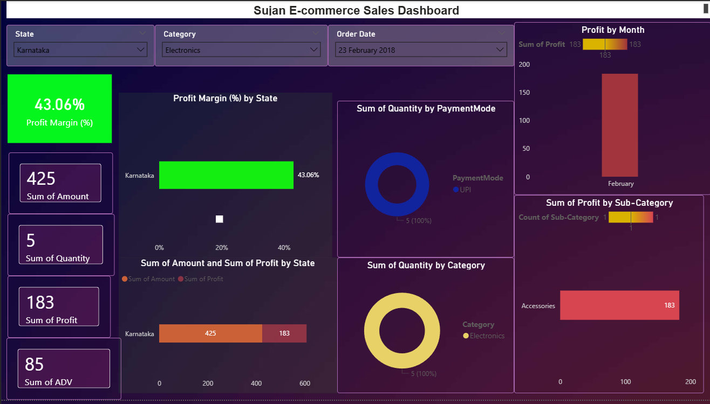
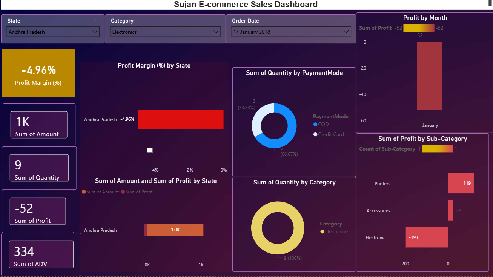

# 📊 E-commerce Sales Dashboard (Power BI)

## 📌 Table of Contents

* [Overview](#-overview)
* [Objective](#-objective)
* [Dataset Description](#-dataset-description)
* [Key Metrics (KPIs)](#-key-metrics-kpis)
* [DAX Measure](#-dax-measure-used)
* [Dashboard Features](#-dashboard-features)
* [Visualizations](#-visualizations)
* [Key Features](#-key-features)
* [Key Insights](#-key-insights)
* [Tools & Technologies](#-tools--technologies)
* [Dashboard Preview](#-dashboard-preview)
* [Conclusion](#-conclusion)
* [Author](#-author)

---

## 🔹 Overview

This project is an **interactive Power BI dashboard** designed to analyze e-commerce sales performance.
It provides insights into **revenue, profit, customer behavior, and product performance** using dynamic visualizations and filters.

---

## 🎯 Objective

* Analyze **sales and profit trends**
* Identify **profitable vs loss-making regions**
* Understand **customer purchasing behavior**
* Evaluate **category and sub-category performance**

---

## 📁 Dataset Description

### 🧾 Orders Table

* Order ID
* Customer Name
* State, City
* Order Date

### 📦 Details Table

* Amount (Sales)
* Profit
* Quantity
* Category / Sub-Category
* Payment Mode
* ADV (Average Value)

🔗 Tables are connected using **Order ID**

---

## 📊 Key Metrics (KPIs)

* 💰 **Total Sales (Amount)**
* 📦 **Total Quantity Sold**
* 📉 **Total Profit**
* 📊 **Profit Margin (%)**
* 📈 **Average Order Value (ADV)**

---

## 📐 DAX Measure Used

```DAX
Total Sales = SUM(Details[Amount])

Total Profit = SUM(Details[Profit])

Total Quantity = SUM(Details[Quantity])

Profit Margin % = DIVIDE(SUM(Details[Profit]), SUM(Details[Amount]), 0)

Average Order Value = DIVIDE(SUM(Details[Amount]), DISTINCTCOUNT(Orders[Order ID]), 0)

Profit per Order = DIVIDE(SUM(Details[Profit]), DISTINCTCOUNT(Orders[Order ID]), 0)

Sales per Unit = DIVIDE(SUM(Details[Amount]), SUM(Details[Quantity]), 0)

Profit Category = 
IF(
    [Profit Margin %] > 0,
    "Profit",
    IF([Profit Margin %] < 0, "Loss", "Neutral")
)
```


---

## 📈 Dashboard Features

### 🎛️ Filters (Slicers)

* State
* Category
* Order Date

---

## 📊 Visualizations

* **Profit Margin by State**
* **Profit by Month**
* **Quantity by Category**
* **Quantity by Payment Mode**
* **Profit by Sub-Category**
* **Sales vs Profit by State**

---

## 🎨 Key Features

* ✔ Interactive dashboard with slicers
* ✔ Conditional formatting (Red–Yellow–Green logic)
* ✔ Clean UI design
* ✔ Real-time filtering

---

## 🧠 Key Insights

* Some regions are **loss-making despite high sales**
* Profit margins vary across states
* Certain categories have **high volume but low profit**
* COD & UPI are most used payment modes
* Monthly profit trends show fluctuations

---

## 🚀 Tools & Technologies

* Power BI
* DAX
* Data Modeling

---

### 🔹 Dashboard Preview



---

### 🟢 Profit Scenario (High Performance)



---

### 🔴 Loss Scenario (Business Issue Detection)




---

## 📌 Conclusion

This dashboard helps in:

* Identifying **loss-making regions**
* Improving **business decisions**
* Enhancing **profitability**

---

## 👤 Author

**Sujan KS**
